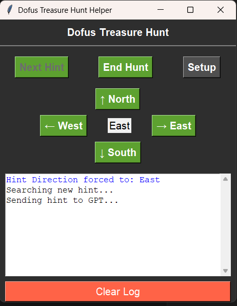

# Dofus Hunter

### Les tâches que l'outil doit être capable de faire sont :
- Lancer le jeu / relancer le jeu si un bug survient.
- Aller lancer une chasse (Utiliser une potion de rappel au Zaap de la chasse, Lancer une chasse, sortir de la maison)
- Se TP au Zaap de la zone de la chasse
- Aller à la position de départ
- Commencer la chasse (Détection de l'indice et sa direction (OCR)), aller à la position selon la base de donnée des indices (déjà dispo et scrapé), Valider l'indice.
- Détecter les Phorreurs et les trouver automatiquement avec de l'OCR. Entrer les coordonnées de la map du Phorreur pour continuer la chasse.
- Annuler une chasse si erreur.
- Détecter que le jeu est toujours lancé, qu'il ne s'est pas fermé suite à un crash.
- Détecter que la chasse n'as pas échoué.
- Détecter qu'il reste des potions de rappel.
- Système d'alerting pour prévenir si un problème est rencontré, et le corriger.
- Se déconnecter du jeu toutes les 10 à 14 heures (de manière aléatoire) pour éviter les suspicions.
- Liste non exhaustive.

### Tester l'outil:
- Ajouter votre clé API de claude.ai dans un .env à la racine du projet.
- Lancer le jeu
- Lancer une chasse
- Aller à la position de départ
- Lancer l'outil avec "python.exe main.py" dans un terminal à la racine du projet.
- Initialiser l'outil avec "Setup"
- Vous serez invité à sélectionner la région correspondante aux coordonnées de la map actuelle.
- Vous serez ensuite invité à sélectionner la région correspondante au widget de la chasse.
- Vous serez enfin invité à sélectionner la région du champ input correspondante à la chatbox afin que l'outil puisse cliquer dessus pour coller les coordonnées des indices.
- Cliquer sur "Start Hunt"
- Attendre que l'outil détecte l'indice
- Valider l'indice ou forcer une direction si claude ne détecte pas la direction de l'indice.

### Informations supplémentaires:
- L'outil est à l'état de prototype, il est possible que des bugs surviennent.
- Si un indice est trouvé, le son "Ding" sera joué. (ping.mp3)
- Si une erreur survient, le son "Error" sera joué. (error.mp3)

### Structure du projet:
- Le projet est divisé en plusieurs parties:
- Le fichier main.py qui est le point d'entrée du projet.
- Le dossier assets contient les assets du projet (sons).
- Le dossier dofus_hints contient le site web et la base de donnée des indices en dur dans le JSON chasse.json.
- Le dossier progression_logs contient les logs de progression de la chasse.
- Le dossier dofus_arrows_data contient les images des flèches pour l'entrainement du modèle de détection de la direction des indices.
- Le dossier arrow_ocr_model contient les scripts permettant de :
    - Préparer les données pour l'entrainement du modèle.
    - Entrainer le modèle.
    - Tester le modèle.
